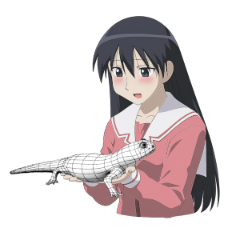

# Salamander

Minecraft 1.7.10 support for [GeckoLib](https://github.com/bernie-g/geckolib) (3, 4, 5), model-related portions of [Citadel](https://github.com/AlexModGuy/Citadel), and OptiFine-format custom entity models (CEM).

<!--

-->

## Dependencies

* [GTNHLib](https://github.com/GTNewHorizons/GTNHLib)   
* [UniMixins](https://github.com/LegacyModdingMC/UniMixins)   

## Documentation

* [Custom entity models (CEM)](https://github.com/JackOfNoneTrades/Salamander/wiki/Custom-Entity-Models): resource packs, supported targets, configuration, and compatibility.
* [Development](https://github.com/JackOfNoneTrades/Salamander/wiki/Development): building, regression tests, and debug models.

## Building

`./gradlew build`

## Credits

* The [GeckoLib](https://github.com/bernie-g/geckolib) contributors
* Citadel compatibility code is derived from [Citadel](https://github.com/AlexModGuy/Citadel) and is licensed under LGPLv3
* Debug fixtures use assets from GeckoLib Unofficial, Alex's Mobs, and Ice and Fire under their original licenses
* The [GTNewHorizons](https://github.com/GTNewHorizons) tooling

## License

`MIT`, except the Citadel-derived compatibility code and identified debug fixtures (`LGPLv3`)

## Buy me creatine

* [ko-fi.com](https://ko-fi.com/jackisasubtlejoke)
* Monero: `893tQ56jWt7czBsqAGPq8J5BDnYVCg2tvKpvwTcMY1LS79iDabopdxoUzNLEZtRTH4ewAcKLJ4DM4V41fvrJGHgeKArxwmJ`

 

